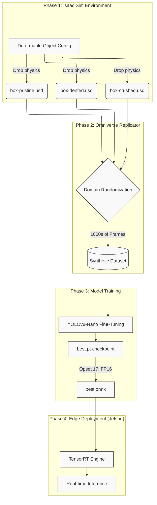
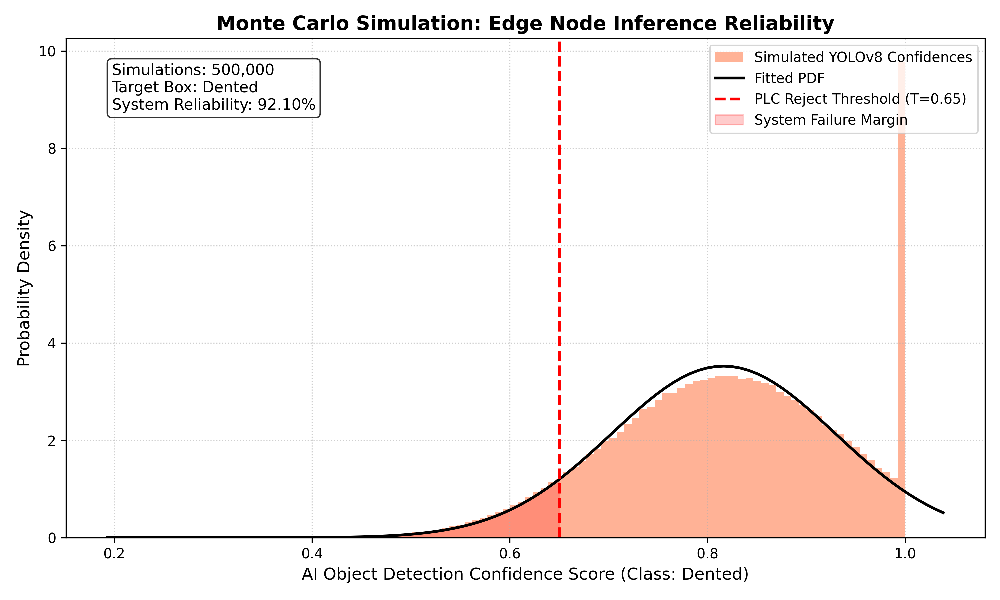

# 📦 Package Integrity Classification via Sim-to-Real
**Breadcrumb Protocol**
* [📖 READ: Walkthrough & Usage Instructions](WALKTHROUGH.md)
* [🏗️ READ: Architectural Build Log](BUILD_LOG.md)
**A zero-shot, end-to-end Cyber-Physical AI pipeline.**
*Training an object detection model to classify the physical state of logistics packages (Pristine, Dented, Crushed) using **100% synthetic data** generated in NVIDIA Isaac Sim, for real-time edge deployment on a Jetson Orin Nano.*
<p align="left">
  <a href="https://github.com/camirian/package-integrity-classification-via-sim-to-real/actions/workflows/ci.yml"></a>
  <a href="https://docs.omniverse.nvidia.com/isaacsim/latest/index.html"></a>
  <a href="https://developer.nvidia.com/embedded/jetson-orin-nano-developer-kit"></a>
  <a href="https://github.com/ultralytics/ultralytics"></a>
  <a href="https://www.python.org/"></a>
</p>
---
## 🎯 Executive Summary
The **"Sim-to-Real Gap"** is the primary bottleneck in modern robotics and autonomous systems. Traditional machine learning relies on massive datasets of manually annotated real-world images—a process that is slow, expensive, and fragile to edge cases.
This project demonstrates a **next-generation Cyber-Physical architecture**. By building physically accurate simulations of deformable assets (cardboard boxes) and employing domain randomization, we generate highly variable, perfectly labeled synthetic datasets. This allows a YOLOv8 object detection model to achieve zero-shot deployment in the real world without seeing a single real photograph during training.
### Core Capabilities Demonstrated
1. **Simulation & MBSE:** Procedurally creating physics-accurate deformable assets in Omniverse.
2. **Synthetic Data Generation:** Utilizing Omniverse Replicator to generate thousands of frames with domain-randomized lighting, backgrounds, and camera poses.
3. **MLOps & Edge Deployment:** Fine-tuning a YOLOv8-Nano architecture and exporting the optimized FP16 ONNX graph for TensorRT inference on Jetson hardware.
---
## 🏗️ Architecture & Pipeline Overview
The project is structured linearly into four distinct phases, mimicking a professional L5 autonomy engineering lifecycle:

## 📁 Project Structure
```text
.
├── CITADEL_TASKS.md             # Project management and requirement tracking
├── phase-1-asset-and-scene-creation/
│   ├── assets/                  # Core USDs: box-pristine.usd, box-dented.usd, box-crushed.usd
│   └── scripts/                 # Isaac Lab APIs for object deformation and USD export
├── phase-2-synthetic-data-generation/
│   └── scripts/                 
│       └── generate-synthetic-data.py  # Omniverse Replicator pipeline + YOLO Writer
├── phase-3-model-training/
│   ├── config/
│   │   └── dataset.yaml         # Ultralytics multi-class configuration
│   └── scripts/
│       └── train.py             # Reproducible training CLI (train, validate, export)
└── phase-4-deployment-and-inference/
    └── ros-packages/            # Empty placeholder for ROS 2 wrapper (future scope)
```
## 🚀 Implementation Guide
### Phase 1: Creating Deformed Assets
The core creative challenge involves generating accurate "damaged" states. Instead of simulating ripping in real-time, the project script instances a high-stiffness DeformableObject and applies physical rigid body kinetics (heavy falling spheres) to pre-compute structural failure. The resulting meshes are serialized to USDs.
### Phase 2: Synthetic Data Generation
The world-class `generate-synthetic-data.py` pipeline utilizes `omni.replicator.core`:
- **Domain Randomization:** Randomizes camera position (uniform hemisphere), sphere-light intensity, color temperature, and rigid body 6-DoF orientation.
- **Annotators:** Attaches `rgb` and `bounding_box_2d_tight` annotators to the render product.
- **Custom YOLOWriter:** Processes structured arrays dynamically into normalized 2D tracking coordinates expected by Ultralytics.
```bash
# Executing inside Isaac Sim Python environment
isaac-sim --exec phase-2-synthetic-data-generation/scripts/generate-synthetic-data.py
```
### Phase 3: Model Training
The `train.py` module defines an enterprise-grade YOLOv8 training loop:
- **Reproducibility:** Strict RNG seeding (torch, numpy, PYTHONHASHSEED).
- **Optimization:** AdamW optimizer, Cosine LR scheduling, early stopping.
- **Observability:** Strong structured logging and nested `config.json` serialization.
- **Edge-Ready:** Automated ONNX export configured precisely for Jetson TensorRT translation.
```bash
python phase-3-model-training/scripts/train.py --task train
python phase-3-model-training/scripts/train.py --task validate
python phase-3-model-training/scripts/train.py --task export
```
### Phase 4: Edge Deployment (Jetson Orin Nano / ROS 2)
```bash
cd phase-4-deployment-and-inference
colcon build --symlink-install
source install/setup.bash
ros2 launch package_integrity_inference inference.launch.py model_path:=/absolute/path/to/best.onnx
```
### Phase 5: Applied System Analytics (Monte Carlo)
Even with highly optimized TensorRT edge inference, bounding box confidence scores in the real world continuously fluctuate due to dynamic lighting, camera noise, and conveyor belt speed. To ensure the physical robotic sorting arm actually rejects defective packages reliably, we employ **Stochastic Monte Carlo Simulations**.
The `/analytics/monte_carlo_confidence_analysis.py` engine simulates 500,000+ noisy inference cycles at the edge node, modeling the AI's output probability density function (PDF). This proves that even with significant variance (σ=0.12), the downstream Programmable Logic Controller (PLC) sorting threshold (T=0.65) triggers with a 92.10% success rate under real-world noise.


## ⚙️ Prerequisites
**Simulation Workstation:**
- NVIDIA RTX GPU (RTX 3070 or higher recommended)
- Omniverse Launcher & Isaac Sim 4.x
- Python 3.10+
**Edge Inference Device:**
- NVIDIA Jetson Orin Nano (Flashed with JetPack 6+)
- DeepStream SDK / Isaac ROS
## 📜 License
Proprietary / Portfolio Demonstration.
